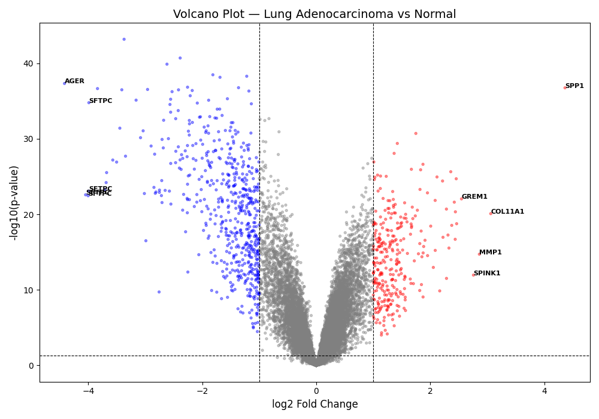
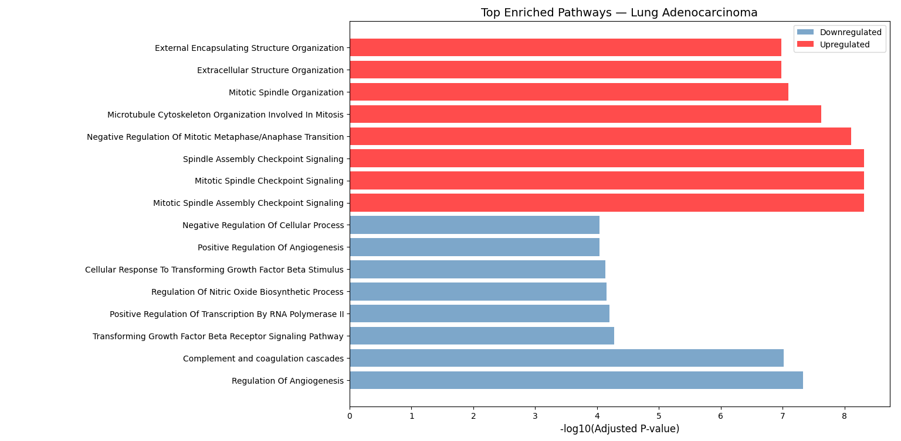
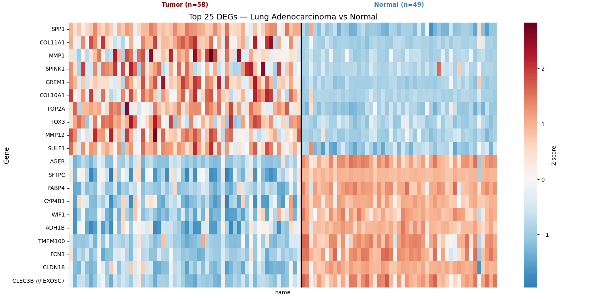
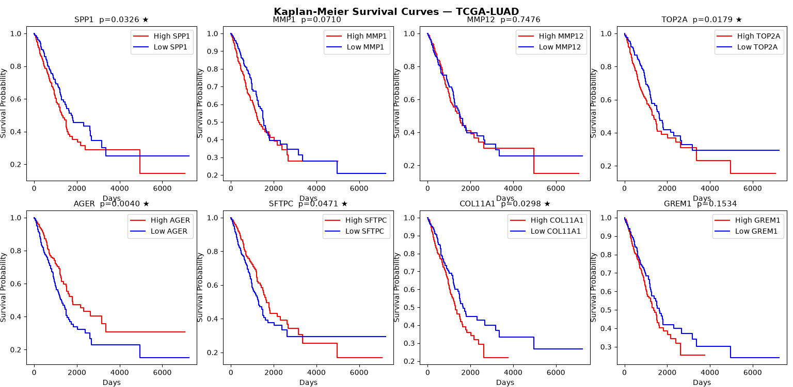

# Lung Adenocarcinoma — Transcriptomic Profiling & Survival Analysis

> Identifying transcriptomic drivers of lung adenocarcinoma and validating their prognostic significance across two independent patient cohorts, using public GEO microarray data and TCGA-LUAD survival records.

---

## Why This Project

Starting from a 107-sample microarray dataset (GSE10072), I identified 859 significantly dysregulated genes, traced them to disrupted biological pathways and then tested whether the top candidates predict survival in 497 independent TCGA-LUAD patients. Five genes held up.

---

## Key Findings

### Differentially Expressed Genes
- **859 significant DEGs** identified (|log2FC| ≥ 1, FDR-adjusted p < 0.05)
- Top upregulated: `SPP1` (+4.4 log2FC), `COL11A1`, `MMP1`, `MMP12`, `TOP2A`
- Top downregulated: `AGER` (−4.4 log2FC), `SFTPC`, `CLDN18`, `CYP4B1`, `ADH1B`

### Pathway Disruption
| Direction | Pathway | Adjusted p-value |
|---|---|---|
|  Upregulated | Mitotic Spindle Assembly Checkpoint | 4.8 × 10⁻⁹ |
|  Upregulated | Extracellular Matrix Organization | 1.1 × 10⁻⁷ |
|  Upregulated | p53 Signaling Pathway (KEGG) | 2.1 × 10⁻⁵ |
|  Downregulated | Regulation of Angiogenesis | 4.7 × 10⁻⁸ |
|  Downregulated | Complement and Coagulation Cascades (KEGG) | 9.5 × 10⁻⁸ |
|  Downregulated | TGF-β Receptor Signaling Pathway | 5.2 × 10⁻⁵ |

### Survival Validation (TCGA-LUAD, n=497)
| Gene | Role | Prognostic Direction | Log-rank p |
|---|---|---|---|
| **AGER** | Lung identity / tumor suppressor | High = better survival | **0.0040** |
| **TOP2A** | DNA replication / proliferation | High = worse survival | **0.0179** |
| **COL11A1** | ECM remodeling / invasion | High = worse survival | **0.0298** |
| **SPP1** | Oncogene / immune modulation | High = worse survival | **0.0326** |
| **SFTPC** | Lung differentiation marker | High = better survival | **0.0471** |

---

## Figures

<table>
  <tr>
    <td><b>Volcano Plot</b><br></td>
    <td><b>Pathway Enrichment</b><br></td>
  </tr>
  <tr>
    <td><b>Expression Heatmap</b><br></td>
    <td><b>Kaplan-Meier Survival Curves</b><br></td>
  </tr>
</table>

---

## Biological Interpretation

Lung adenocarcinoma rewires gene expression along three axes:

**1. Loss of cellular identity**
The lung-specific genes `AGER` and `SFTPC` were among the most strongly downregulated in tumor tissue. Both have been reported as prognostic markers, with higher expression being associated with better patient survival. Their loss may reflect the de-differentiation that occurs during malignant transformation.

**2. Proliferation without constraint**
The mitotic checkpoint genes `CDC20`, `BUB1B`, `MAD2L1`, and `TTK` were strongly upregulated, along with `TOP2A`, which is a well-known marker of highly proliferative and aggressive tumors. In this dataset, higher `TOP2A` expression was also associated with poorer survival (p = 0.018).


**3. Stromal remodeling for invasion**
MMP family proteases (`MMP1`, `MMP7`, `MMP9`, `MMP12`) and collagen genes (`COL11A1`, `COL10A1`, `COL1A1`) were also upregulated, suggesting disruption of the normal tissue structure. `COL11A1`, which has been linked to more invasive tumor behavior, was also associated with poorer survival independently (p = 0.030).

---


## Methods

**1. Data Acquisition**
GSE10072 was downloaded from NCBI GEO using GEOparse, yielding a 22,283-probe × 107-sample expression matrix across 58 lung adenocarcinoma tumors and 49 matched normal tissues.

**2. Differential Expression**
Welch's t-test was applied per probe, followed by Benjamini-Hochberg FDR correction (α = 0.05). Probes were filtered at |log2FC| ≥ 1, yielding 859 significant DEGs after Affymetrix GPL96 probe-to-gene mapping.

**3. Pathway Enrichment**
Over-Representation Analysis (ORA) was performed using GSEApy Enrichr against KEGG 2021 Human and GO Biological Process 2023 databases, run separately on upregulated and downregulated gene sets.

**4. Survival Validation**
Top DEGs were tested in 497 TCGA-LUAD patients. Samples were split into high/low expression groups by median, and Kaplan-Meier curves were compared using the log-rank test.

---


## Repository Structure

```
lung-adenocarcinoma-deg-analysis/
│
├── README.md
├── requirements.txt
│
├── scripts/
│   ├── 01_download_data.py       # Downloads GEO + TCGA data
│   ├── 02_deg_analysis.py        # DEG analysis, pathway enrichment, figures
│   └── 03_survival_analysis.py   # TCGA-LUAD Kaplan-Meier survival validation
│
├── results/
│   ├── significant_DEGs.csv      # 859 significant DEGs (probe IDs)
│   ├── DEGs_named.csv            # DEGs with gene symbols mapped
│   ├── pathways_up.csv           # Enriched pathways — upregulated genes
│   └── pathways_down.csv         # Enriched pathways — downregulated genes
│
└── figures/
    ├── volcano_plot.png          # log2FC vs significance
    ├── pathway_plot.png          # Top enriched pathways bar chart
    ├── heatmap.png               # Top 25 DEGs across all 107 samples
    └── KM_curves.png             # Kaplan-Meier curves — TCGA-LUAD (n=497)
```

---

## Reproducing This Analysis

```bash
# Clone the repository
git clone https://github.com/Agni-18/lung-adenocarcinoma-deg-analysis
cd lung-adenocarcinoma-deg-analysis

# Install dependencies
pip install -r requirements.txt

# Run pipeline in order
python scripts/01_download_data.py
python scripts/02_deg_analysis.py
python scripts/03_survival_analysis.py
```

>  GSE10072 is downloaded automatically from NCBI GEO (~26MB). TCGA expression data is fetched from cBioPortal datahub (~74MB). Requires internet connection on first run.

---

## Tools & Libraries

| Library | Version | Purpose |
|---|---|---|
| GEOparse | 2.0.3 | GEO dataset download & parsing |
| pandas / numpy | latest | Data manipulation |
| scipy / statsmodels | latest | Statistical testing & FDR correction |
| GSEApy | latest | Pathway enrichment (Enrichr ORA) |
| matplotlib / seaborn | latest | Visualization |
| lifelines | latest | Kaplan-Meier survival analysis |

---

## Datasets

| Dataset | Accession | Platform | Samples |
|---|---|---|---|
| Kim et al., 2007 | [GSE10072](https://www.ncbi.nlm.nih.gov/geo/query/acc.cgi?acc=GSE10072) | Affymetrix HG-U133A | 107 |
| TCGA-LUAD | [cBioPortal](https://www.cbioportal.org/study/summary?id=luad_tcga_pan_can_atlas_2018) | RNA-Seq V2 RSEM | 510 |

---

## Author

**Agnidipa**
M.Tech Bioinformatics · Delhi Technological University

[LinkedIn](https://www.linkedin.com/in/agnidipa-sett-6aa896323/)
[GitHub](https://github.com/Agni-18)
